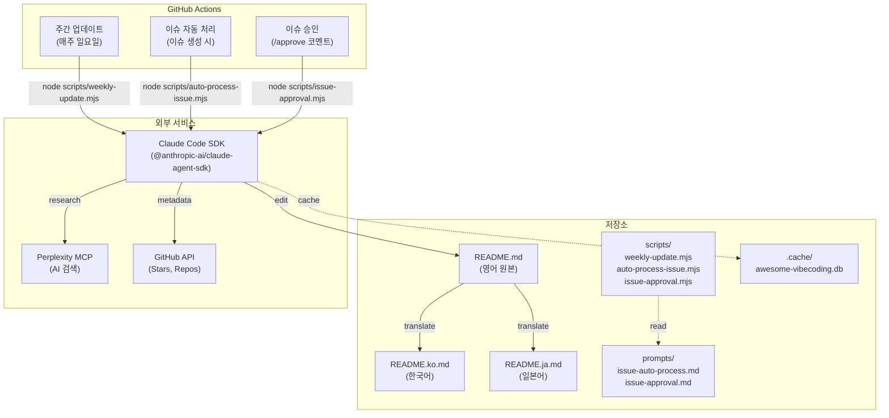
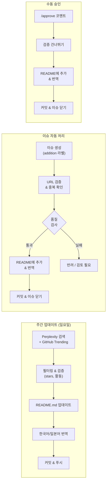

# Awesome Vibe Coding (한국어)

*Language: [English](README.md) | [한국어](README.ko.md) | [日本語](README.ja.md)*

**Vibe Coding** 관련 리소스를 정리한 목록입니다. Vibe Coding은 AI 네이티브 프로그래밍 패러다임으로, 자연어로 의도를 설명하면 AI가 코드를 생성합니다.

> **AI가 관리합니다**: 이 저장소는 [Claude Code](https://claude.ai/code) + [Perplexity MCP](https://github.com/ppl-ai/modelcontextprotocol)를 사용하여 매주 자동 업데이트됩니다. 번역은 Claude Code hooks를 통해 자동 동기화됩니다. [자세히 보기 →](docs/automation.md)

> **"완전히 분위기에 몸을 맡기고, 지수적 성장을 받아들이며, 코드가 존재한다는 사실조차 잊으세요."**
> — Andrej Karpathy, 2025년 2월

---

## 목차

- [Vibe Coding이란?](#vibe-coding이란)
- [핵심 원칙](#핵심-원칙)
- [도구](#도구)
  - [IDE & 편집기 어시스턴트](#ide--편집기-어시스턴트)
  - [에이전트 기반 코딩 환경](#에이전트-기반-코딩-환경)
  - [MCP 서버 & 도구](#mcp-서버--도구)
  - [클라우드 & 플랫폼 통합](#클라우드--플랫폼-통합)
- [워크플로우 & 템플릿](#워크플로우--템플릿)
- [모범 사례](#모범-사례)
- [도메인별 응용](#도메인별-응용)
- [학습 자료](#학습-자료)
  - [연구 논문](#연구-논문)
  - [아티클 & 매뉴얼](#아티클--매뉴얼)
  - [비디오 & 튜토리얼](#비디오--튜토리얼)
- [커뮤니티](#커뮤니티)
- [관련 Awesome 리스트](#관련-awesome-리스트)
- [기여하기](#기여하기)

---

## Vibe Coding이란?

[Vibe Coding](https://en.wikipedia.org/wiki/Vibe_coding)은 사용자가 자연어로 문제를 설명하면 AI가 필요한 코드를 생성하는 AI 보조 프로그래밍 접근 방식입니다. 개발자가 상세한 코드 로직을 깊이 이해하거나 관여할 필요가 없습니다. 이 용어는 AI 연구자 **Andrej Karpathy** 가 2025년 2월에 만들었습니다.

### 패러다임 비교

| 패러다임 | 접근 방식 | 사람의 역할 | 적합한 용도 |
|----------|----------|------------|----------|
| **전통적 코딩** | 수동 구문 기반 작성 | 모든 코드 작성/읽기 | 완전한 제어, 프로덕션 시스템 |
| **AI 보조 코딩** | LLM이 제안, 사람이 검토/편집 | 코드 검토 및 정제 | 감독을 통한 빠른 개발 |
| **Vibe Coding** | 자연어에서 AI로, 테스트만 평가 | 의도로 가이드, 결과 테스트 | 빠른 프로토타이핑, MVP |

---

## 핵심 원칙

- **자연어 우선** — 구현 방법이 아닌 원하는 것을 설명
- **명세 vs Vibe** — 철저한 명세보다 느슨하고 의도 중심적인 설명
- **컨텍스트 관리** — 여러 턴의 대화에서 상태 유지
- **책임 경계** — 사람은 판단/테스트 담당, AI는 생성 담당
- **신뢰 구축** — 반복적 테스트와 피드백으로 AI 출력에 대한 의존도 향상
- **불확실성 수용** — 한 줄씩 검토하지 않고 테스트를 기반으로 AI 코드 수용

---

## 도구

### IDE & 편집기 어시스턴트

개발 환경에 통합된 AI 기반 코드 완성 및 지원.

| 도구 | 설명 |
|------|-------------|
| [**GitHub Copilot**](https://github.com/features/copilot) | 자동 완성, 채팅, 다중 IDE 지원을 갖춘 AI 페어 프로그래머 |
| [**Cursor**](https://www.cursor.com/) | 컨텍스트 기반 코드 생성 및 인라인 채팅을 갖춘 VS Code 포크 |
| [**Windsurf**](https://codeium.com/windsurf) | Codeium의 AI 네이티브 IDE, Cascade AI 및 다중 LLM 지원 |
| [**Claude Code**](https://docs.anthropic.com/en/docs/agents-and-tools/claude-code/overview) | Anthropic의 CLI 기반 에이전트 코딩 어시스턴트 |
| [**OpenAI Codex CLI**](https://openai.com/codex/) | 자연어 프롬프트를 사용하는 오픈소스 CLI 코딩 에이전트 |
| [**Google Jules**](https://jules.google) | Gemini 2.5 Pro 기반 자율 AI 코딩 에이전트 |
| [**Gemini Code Assist**](https://cloud.google.com/products/gemini/code-assist) | Cloud/IDE용 Google의 AI 코드 완성 및 채팅 |
| [**dbForge AI Assistant**](https://www.devart.com/dbforge/ai-assistant/) | dbForge 제품에 통합된 AI 기반 SQL 코딩 도구 |
| [**JetBrains AI**](https://www.jetbrains.com/ai/) | Junie 에이전트를 갖춘 IntelliJ/PyCharm 깊은 통합 |
| [**Augment Code**](https://www.augmentcode.com) | 깊은 컨텍스트와 보안(SOC 2)을 갖춘 엔터프라이즈 AI |
| [**Tabnine**](https://www.tabnine.com/) | 코딩 스타일에 적응하는 딥러닝 자동 완성 |
| [**Amazon Q Developer**](https://aws.amazon.com/q/developer/) | AWS 통합 AI 코딩 어시스턴트 |
| [**Continue**](https://www.continue.dev) | 오픈소스 구성 가능 AI 어시스턴트 프레임워크 |
| [**Qodo**](https://www.qodo.ai) | AI 코드 리뷰 엔진 (구 CodiumAI) |
| [**Sourcegraph Cody**](https://sourcegraph.com/cody) | 코드 이해 및 검색을 위한 AI 어시스턴트 |
| [**Supermaven**](https://supermaven.com) | 고속 AI 코드 완성 |
| [**Cline**](https://github.com/cline/cline) | 파일/터미널/브라우저 자동화를 지원하는 오픈소스 AI 어시스턴트 |
| [**Roo Code**](https://github.com/RooVetGit/Roo-Code) | 여러 역할(설계자, QA, PM)을 지원하는 AI 어시스턴트 |
| [**Google Antigravity**](https://antigravity.google) | 멀티 에이전트 오케스트레이션을 갖춘 에이전트 기반 IDE (Gemini 3 Pro) |
| [**opencode**](https://github.com/opencode-ai/opencode) | 다중 프로바이더 및 MCP를 지원하는 오픈소스 TUI 코딩 에이전트 |
| [**Aider**](https://github.com/paul-gauthier/aider) | git 통합을 갖춘 터미널 AI 페어 프로그래밍 |
| [**Zed AI**](https://zed.dev/) | 네이티브 AI 어시스턴트를 통합한 고성능 편집기 |
| [**Void**](https://github.com/voideditor/void) | 자율 AI 코딩 기능을 갖춘 오픈소스 VS Code 포크 |
| [**Melty**](https://github.com/meltylabs/melty) | 대화형 인터페이스를 갖춘 채팅 우선 코드 편집기 |
| [**CodeGPT**](https://codegpt.co) | VS Code 및 IDE용 다중 LLM 지원 AI 코딩 어시스턴트 |
| [**Wingman AI**](https://github.com/RussellCanfield/wingman-ai-vscode-extension) | Ollama, HuggingFace, OpenAI, Anthropic을 지원하는 오픈소스 VSCode 확장 |
| [**DeepSeek CLI**](https://github.com/holasoymalva/deepseek-cli) | DeepSeek Coder 모델 기반 터미널 AI 코딩 어시스턴트 |
| [**Codeium**](https://codeium.com/) | 70개 이상 언어 지원하는 무료 AI 코드 완성 |
| [**Pieces for Developers**](https://pieces.app/) | 자동 코드 스니펫 관리 및 컨텍스트를 갖춘 AI 어시스턴트 |
| [**Refact.ai**](https://refact.ai/) | 프라이버시 중심 자체 호스팅 AI 코딩 어시스턴트 |
| [**Mutable.ai**](https://mutable.ai/) | 자동 테스트, 문서화, 리팩토링을 위한 AI |
| [**CopilotKit**](https://github.com/CopilotKit/CopilotKit) | 채팅 및 생성 UI를 갖춘 AI 코파일럿 구축 프레임워크 |
| [**Kiro**](https://kiro.dev) | 요구사항을 코드와 테스트로 변환하는 AWS 스펙 기반 AI IDE |
| [**Warp**](https://www.warp.dev) | 자연어 명령과 에이전트 모드를 갖춘 AI 네이티브 터미널 |
| [**PearAI**](https://trypear.ai) | 통합 검색 기능을 갖춘 오픈소스 VS Code AI 편집기 |
| [**OpenPaw**](https://github.com/daxaur/openpaw) | Claude Code를 38개 이상의 스킬을 갖춘 개인 어시스턴트로 확장하는 CLI 도구 |
| [**Gemini CLI**](https://github.com/google-gemini/gemini-cli) | Gemini 모델 기반 Google의 오픈소스 에이전트 코딩 CLI |
| [**Tabby**](https://tabbyml.com) | 프라이버시 우선 설계의 자체 호스팅 오픈소스 AI 코딩 어시스턴트 |
| [**Aide**](https://aide.dev) | 코드베이스 전반의 문제를 자율적으로 수정할 수 있는 능동적 AI 에이전트가 내장된 오픈소스 VS Code 포크 |
| [**Blackbox AI**](https://www.blackbox.ai) | 20개 이상 언어를 지원하는 AI 코드 자동완성 및 생성 도구, 브라우저 내 코딩으로 인기 |
| [**llm.log**](https://github.com/lanesket/llm.log) | AI 에이전트 API 호출을 캡처하는 로컬 프록시 — 토큰, 비용, 프롬프트, 지연 시간을 TUI 대시보드에서 확인 |
| [**Phind**](https://www.phind.com) | 코드, 오류, 기술 Q&A를 위한 AI 기반 개발자 검색 엔진 |
| [**Bito AI**](https://bito.ai) | VS Code 및 JetBrains IDE용 AI 코드 리뷰 및 생성 어시스턴트 |
| [**PR-Agent**](https://github.com/Codium-ai/pr-agent) | 자동화된 풀 리퀘스트 분석 및 리뷰를 위한 오픈소스 AI 에이전트 |
| [**Caliber**](https://github.com/caliber-ai-org/ai-setup) | Claude Code, Cursor, Codex용 AI 에이전트 설정을 생성하고 동기화하는 CLI |
| [**roboco-cli**](https://github.com/roboco-io/roboco-cli) | Claude Code를 활용한 바이브 코딩을 위한 AI 네이티브 개발 스캐폴딩 시스템 |
| [**vibe-ready**](https://github.com/roboco-io/vibe-ready-cli) | Claude Agent SDK를 활용하여 6개 카테고리 스코어링으로 리포지토리의 바이브 코딩 준비도를 분석하는 CLI 도구 |
| [**oh-my-claudecode**](https://github.com/Yeachan-Heo/oh-my-claudecode) | 학습 곡선 제로의 Claude Code 멀티 에이전트 오케스트레이션 |
| [**vmux**](https://github.com/roboco-io/vmux) | AI 코딩 에이전트를 위한 알림 및 세션 관리 기능이 있는 VS Code 터미널 확장 |
| [**Codebuff**](https://github.com/CodebuffAI/codebuff) | 서브 에이전트 조율 기능을 갖춘 오픈소스 터미널 AI 에이전트, SWE-bench 61% 정확도 |
| [**Crush**](https://github.com/charmbracelet/crush) | Charmbracelet 의 매력적인 터미널 AI 코딩 에이전트, LSP 통합 및 멀티 모델 지원 |

### 에이전트 기반 코딩 환경

엔드투엔드 개발 작업을 처리하는 자율 AI 시스템.

| 도구 | 설명 |
|------|-------------|
| [**Devin**](https://www.cognition.ai/devin) | Cognition의 자율 AI 소프트웨어 엔지니어 |
| [**OpenHands**](https://github.com/All-Hands-AI/OpenHands) | 오픈소스 자율 AI 소프트웨어 개발자 |
| [**Goose**](https://block.github.io/goose/) | Block의 오픈소스 코딩 어시스턴트, MCP 지원 |
| [**OpenManus**](https://github.com/mannaandpoem/OpenManus) | AI 보조 문서 작성을 위한 오픈소스 프레임워크 |
| [**Vibe Compiler (vibec)**](https://github.com/Strawberry-Computer/vibe-compiler) | 프롬프트를 코드로 변환하는 자체 컴파일 도구 |
| [**AlphaCode**](https://alphacode.deepmind.com/) | DeepMind의 경쟁 프로그래밍 AI |
| [**Cherry Studio**](https://github.com/CherryHQ/cherry-studio) | 자율 코딩 및 300개 이상의 어시스턴트를 갖춘 AI Agent 데스크탑 |
| [**OpenSpec**](https://github.com/Fission-AI/OpenSpec) | AI 코딩 어시스턴트를 위한 스펙 기반 개발 프레임워크 |
| [**SWE-agent**](https://github.com/princeton-nlp/SWE-agent) | GitHub 이슈를 자율적으로 해결하는 Stanford 에이전트 |
| [**gpt-engineer**](https://github.com/gpt-engineer-org/gpt-engineer) | 자연어 명세로부터 전체 코드베이스 구축 |
| [**MetaGPT**](https://github.com/geekan/MetaGPT) | 소프트웨어 회사 역할을 시뮬레이션하는 멀티 에이전트 프레임워크 |
| [**AutoGPT**](https://github.com/Significant-Gravitas/AutoGPT) | 복잡한 코딩 작업을 위한 자율 AI 에이전트 |
| [**Sweep**](https://github.com/sweepai/sweep) | 이슈 및 PR을 위한 AI 기반 GitHub 어시스턴트 |
| [**Devika**](https://github.com/stitionai/devika) | Devin의 대안인 최초의 오픈소스 에이전트 기반 소프트웨어 엔지니어 |
| [**smol-ai developer**](https://github.com/smol-ai/developer) | 앱용 임베드 가능한 개발자 에이전트 라이브러리 |
| [**E2B**](https://github.com/e2b-dev/e2b) | 엔터프라이즈급 AI 에이전트를 위한 안전한 클라우드 샌드박스 환경 |
| [**Plandex**](https://plandex.ai) | 복잡한 멀티스텝 작업을 위한 오픈소스 터미널 AI 코딩 엔진 |
| [**Cosine**](https://cosine.sh) | 복잡한 코드베이스 작업을 위한 자율 AI 소프트웨어 엔지니어 |
| [**Factory**](https://factory.ai) | 자율 코드 리뷰, 테스트, PR 생성을 위한 AI Droids |
| [**Amp**](https://ampcode.com) | Sourcegraph의 터미널 우선 에이전트 코딩 어시스턴트 |
| [**Devon**](https://github.com/entropy-research/Devon) | Devin의 대안인 오픈소스 자율 코딩 에이전트 |
| [**Copilot Workspace**](https://githubnext.com/projects/copilot-workspace) | 이슈에서 PR까지의 워크플로우를 위한 GitHub의 에이전트 환경 |
| [**Agentless**](https://github.com/OpenAutoCoder/Agentless) | 자율 소프트웨어 엔지니어링을 위한 미니멀리스트 오픈소스 접근 방식 |
| [**Suna**](https://github.com/kortix-ai/suna) | 브라우저, 코드 실행, 파일 시스템을 갖춘 개발 작업용 오픈소스 범용 AI 에이전트 |
| [**micro-agent**](https://github.com/BuilderIO/micro-agent) | 테스트가 통과할 때까지 TDD 방식으로 코드를 작성하고 반복 수정하는 CLI 도구 |
| [**Potpie**](https://github.com/potpie-ai/potpie) | 코드베이스 디버깅, 테스트, 코드 리뷰를 위한 오픈소스 AI 에이전트 |
| [**RA.Aid**](https://github.com/ai-christianson/RA.Aid) | 리서치, 계획 수립, 다단계 코드 생성을 결합한 자율 개발 에이전트 |
| [**serverless-openclaw**](https://github.com/serithemage/serverless-openclaw) | Web UI 및 Telegram 인터페이스를 갖춘 AWS 서버리스 인프라에서 OpenClaw AI 에이전트를 온디맨드로 실행 |
| [**serverless-autoresearch**](https://github.com/roboco-io/serverless-autoresearch) | HUGI 패턴을 적용한 SageMaker Spot Training(H100)에서 Karpathy의 autoresearch를 병렬 진화시키는 파이프라인 |
| [**mymir**](https://github.com/FrkAk/mymir) | 컨텍스트 네트워크를 갖춘 AI 코딩 에이전트용 프로젝트 관리 레이어 |

### MCP 서버 & 도구

AI 기능을 확장하는 [Model Context Protocol](https://modelcontextprotocol.io/) 서버.

| 카테고리 | 서버 | 설명 |
|----------|---------|-------------|
| **Git 작업** | [Git](https://github.com/modelcontextprotocol/servers/tree/main/src/git), [Rube](https://github.com/ComposioHQ/Rube), [GitHub](https://github.com/modelcontextprotocol/servers/tree/main/src/github) | 저장소 읽기/검색/조작, 이슈/PR 관리 |
| **데이터베이스** | [ClickHouse](https://github.com/ClickHouse/mcp-clickhouse), [MongoDB](https://github.com/mongodb-js/mongodb-mcp-server), [Chroma](https://github.com/chroma-core/chroma-mcp), [Excel](https://github.com/haris-musa/excel-mcp-server), [PostgreSQL](https://github.com/modelcontextprotocol/servers/tree/main/src/postgres), [Neon](https://github.com/neondatabase/mcp-server-neon) | 쿼리, 마이그레이션, 시맨틱 검색, 스프레드시트 작업, 서버리스 Postgres |
| **보안** | [Semgrep](https://github.com/semgrep/mcp), [Sentry](https://github.com/getsentry/sentry-mcp) | 코드 스캐닝, 오류 추적 |
| **브라우저 & 자동화** | [Chrome MCP](https://github.com/hangwin/mcp-chrome), [Playwright MCP](https://github.com/executeautomation/mcp-playwright), [AnyCrawl](https://github.com/any4ai/anycrawl-mcp-server), [Fetch](https://github.com/modelcontextprotocol/servers/tree/main/src/fetch), [Puppeteer](https://github.com/modelcontextprotocol/servers/tree/main/src/puppeteer), [Firecrawl MCP](https://github.com/mendableai/firecrawl-mcp-server) | 브라우저 자동화, 테스팅, 웹 스크래핑, 콘텐츠 가져오기 |
| **모바일** | [Mobile MCP](https://github.com/mobile-next/mobile-mcp) | iOS/Android 자동화 및 스크래핑 (에뮬레이터, 시뮬레이터, 실제 디바이스) |
| **검색 & 지식** | [Brave Search](https://github.com/modelcontextprotocol/servers/tree/main/src/brave-search), [Exa](https://github.com/exa-labs/exa-mcp-server), [Perplexity](https://github.com/anthropics/mcp-perplexity), [Tavily](https://github.com/tavily-ai/tavily-mcp) | 웹 검색, 시맨틱 검색, 리서치, AI 최적화 검색 |
| **개발** | [Xcode Build MCP](https://github.com/cameroncooke/XcodeBuildMCP), [Spec Workflow MCP](https://github.com/Pimzino/spec-workflow-mcp), [Slack](https://github.com/modelcontextprotocol/servers/tree/main/src/slack), [Linear](https://github.com/jerhadf/linear-mcp-server) | Xcode 통합, 스펙 기반 개발, 팀 커뮤니케이션, 프로젝트 관리 |
| **파일 시스템** | [Filesystem](https://github.com/modelcontextprotocol/servers/tree/main/src/filesystem) | 안전한 읽기/쓰기 작업 |
| **CI/CD** | [GitHub MCP](https://github.com/github/github-mcp-server) | 이슈, PR, Actions를 위한 전체 GitHub API 액세스 |
| **실행** | [E2B](https://github.com/e2b-dev/mcp-server) | AI 생성 코드 실행을 위한 보안 클라우드 샌드박스 |
| **문서** | [Context7](https://github.com/upstash/context7) | AI 컨텍스트에 주입되는 최신 라이브러리 문서 |
| **파일 시스템** | [Filesystem](https://github.com/modelcontextprotocol/servers/tree/main/src/filesystem) | 안전한 읽기/쓰기 작업 |
| **결제** | [Stripe](https://github.com/stripe/agent-toolkit) | 결제, 고객, 구독을 위한 공식 Stripe MCP |
| **브라우저 (클라우드)** | [Browserbase](https://github.com/browserbase/mcp-server-browserbase) | AI 에이전트를 위한 클라우드 브라우저 자동화 MCP |
| **백엔드** | [Supabase](https://github.com/supabase-community/supabase-mcp) | Supabase 프로젝트 관리, SQL 실행, 마이그레이션 처리 |
| **디자인** | [Figma](https://github.com/figma/figma-developer-mcp) | AI 기반 프론트엔드 개발을 위한 Figma 디자인 데이터 |
| **클라우드 인프라** | [Cloudflare](https://github.com/cloudflare/mcp-server-cloudflare) | AI를 통한 Cloudflare Workers, KV, D1, R2 관리 |
| **MCP 클라이언트** | [5ire](https://github.com/nanbingxyz/5ire) | MCP 지원 및 로컬 지식베이스를 갖춘 크로스 플랫폼 데스크탑 AI 어시스턴트 |
| **생산성** | [Notion MCP](https://github.com/makenotion/notion-mcp-server) | 페이지, 데이터베이스, 블록 읽기·쓰기를 위한 공식 Notion MCP 서버 |
| **배포** | [Vercel MCP](https://github.com/vercel/mcp-adapter) | AI를 통한 프로젝트 배포, 도메인 관리, 환경 변수 설정 |
| **프로젝트 관리** | [Jira MCP](https://github.com/sooperset/mcp-atlassian) | 이슈 및 문서 관리를 위한 Atlassian Jira 및 Confluence 통합 |
| **멀티 서비스** | [Composio](https://github.com/ComposioHQ/composio) | Linear, Notion, Slack 등 100개 이상의 서비스를 AI 에이전트에 연결하는 MCP 자동화 |

📚 전체 목록은 [awesome-mcp-servers](https://github.com/wong2/awesome-mcp-servers)를 참조하세요.

### 클라우드 & 플랫폼 통합

AI 보조 개발을 위한 브라우저 기반 및 클라우드 플랫폼.

| 도구 | 설명 |
|------|-------------|
| [**Replit**](https://replit.com/) | Ghostwriter AI를 갖춘 브라우저 기반 IDE |
| [**v0**](https://v0.dev/) | Vercel의 UI/React 생성 AI |
| [**Bolt.new**](https://bolt.new/) | StackBlitz의 자연어 앱 빌딩 |
| [**Lovable**](https://lovable.dev/) | Supabase를 사용한 풀스택 앱 생성 |
| [**Berrry**](https://berrry.app) | 소셜 게시물을 웹 앱으로 변환 |
| [**Duet AI**](https://workspace.google.com/solutions/ai/) | Google Workspace AI 통합 |
| [**Trae AI**](https://www.trae.ai/) | 콘텐츠 제작을 위한 AI 플랫폼 |
| [**CodeSandbox AI**](https://codesandbox.io/ai) | 브라우저 샌드박스에서 AI 기반 코드 생성 |
| [**GitHub Copilot Workspace**](https://github.com/features/copilot) | GitHub을 위한 AI 네이티브 개발 환경 |
| [**Create.xyz**](https://create.xyz/) | 자연어 프롬프트를 사용한 웹 앱 구축 |
| [**Wordware**](https://www.wordware.ai/) | 개발자를 위한 노코드 AI 에이전트 빌더 |
| [**Kombai**](https://kombai.com/) | Figma 디자인을 코드로 변환하는 AI |
| [**Dyad**](https://github.com/dyad-sh/dyad) | 로컬 오픈소스 AI 앱 빌더 (v0/Lovable/Bolt 대안) |
| [**Firebase Studio**](https://firebase.studio) | Gemini를 갖춘 Google의 AI 우선 브라우저 IDE, 구 Project IDX |
| [**Google AI Studio**](https://aistudio.google.com) | Gemini 모델로 빌드 및 프로토타이핑을 위한 브라우저 IDE |
| [**Databutton**](https://databutton.com) | Python 백엔드를 갖춘 AI 기반 풀스택 앱 빌더 |
| [**Tempo Labs**](https://tempolabs.ai/) | 시각적 편집기와 코드 내보내기를 갖춘 AI 기반 React UI 빌더 |
| [**Gitpod**](https://www.gitpod.io/) | AI 지원 워크스페이스 자동화를 갖춘 클라우드 개발 환경 |
| [**Bolt.diy**](https://github.com/stackblitz-labs/bolt.diy) | 자체 API 키를 사용하는 오픈소스 Bolt.new 대안 |
| [**Marblism**](https://marblism.com) | 텍스트 프롬프트에서 풀스택 Next.js 앱을 생성하는 AI |
| [**Subframe**](https://subframe.com) | 깔끔한 React 컴포넌트 코드를 생성하는 AI 보조 UI 빌더 |
| [**BuildShip**](https://buildship.com) | 로우코드 노드를 갖춘 비주얼 AI 워크플로우 및 백엔드 빌더 |
| [**Onlook**](https://onlook.dev) | AI 코드 생성 기능이 있는 React/Next.js용 오픈소스 브라우저 기반 시각적 편집기 |
| [**GitHub Spark**](https://githubnext.com/projects/spark) | GitHub Next가 개발한 자연어 마이크로 앱 빌더, 브라우저에서 실행 |
| [**Dify**](https://github.com/langgenius/dify) | LLM 기반 애플리케이션 구축 및 배포를 위한 오픈소스 플랫폼 |
| [**Lazy AI**](https://www.getlazy.ai) | 원클릭 클라우드 배포를 지원하는 채팅 기반 웹 앱 빌더 |
| [**Rosebud AI**](https://rosebud.ai) | 3D 게임과 인터랙티브 웹 앱을 위한 바이브 코딩 플랫폼 |
| [**Emergent**](https://emergent.sh) | 원클릭 배포와 커스텀 도메인을 지원하는 AI 풀스택 바이브 코딩 플랫폼 |
| [**Hostinger Horizons**](https://hostinger.com/horizons) | 음성/텍스트/이미지 프롬프트와 내장 호스팅을 지원하는 AI 노코드 앱 빌더 |

---

## 워크플로우 & 템플릿

| 워크플로우 | 주요 단계 |
|----------|-----------|
| **새 기능** | Vibe Brief → PRD로 검증 → 수직 슬라이스 계획 → 단계별 구현 |
| **리팩토링** | 패턴/냄새 분석 → 안전 전략 → 순차적 작은 단계 |
| **버그 수정** | 분류 및 가설 → 최소 실패 테스트 → 수정 → 검증 |
| **테스트 생성** | 중요 동작 식별 → 위험도별 우선순위 → 테스트 생성 |

**권장 아티팩트**: PRD.md, TECH_DESIGN.md, NOTES.md, CHANGELOG.md

📚 **[전체 워크플로우 & 템플릿 가이드 →](docs/workflows-and-templates.md)** — 세션 설정, 프롬프트 템플릿, 플레이북

---

## 모범 사례

### 해야 할 것 ✅

- **컨텍스트로 시작** — 아키텍처, 제약 조건, 관련 코드 제공
- **작업 분해** — 계획 → 생성 → 테스트 → 리팩토링으로 나누기
- **테스트 우선** — 코드 전이나 동시에 테스트 생성
- **샌드박스 사용** — 격리된 환경에서 AI 코드 실행
- **"주니어 엔지니어"로 검토** — 보안 및 아키텍처를 위해 항상 사람이 검토
- **아티팩트 유지** — PRD, NOTES, CHANGELOG 업데이트 유지

### 하지 말아야 할 것 ❌

- **"간단한" 코드의 검토 생략** — AI가 미묘한 버그를 도입할 수 있음
- **프롬프트에 비밀 포함** — 환경 변수나 vault 사용
- **공개 모델에 독점 코드 제공** — 데이터 유출 위험
- **원시 출력 맹목적 수용** — Vibe ≠ 검증 없는 분위기
- **복잡한 결정에 AI 과도하게 의존** — 사람이 판단 담당

---

## 도메인별 응용

| 도메인 | 사용 사례 | 예시 도구 |
|--------|-----------|---------------|
| **웹/앱/백엔드** | CRUD 앱, SaaS, 마이크로서비스 | [Lovable](https://lovable.dev/), [Cursor](https://www.cursor.com/), [v0](https://v0.dev/) |
| **데이터 & ML** | 파이프라인 생성, 실험 자동화 | [Zapier](https://zapier.com/), [n8n](https://n8n.io/) |
| **DevOps** | IaC, CI/CD 설정, 모니터링 | [Pulumi](https://www.pulumi.com/), [Terraform](https://www.terraform.io/) |
| **연구** | 노트북 자동화, 데이터 시각화 | [ChatGPT](https://chat.openai.com/), [Claude](https://claude.ai/) |

---

## 학습 자료

### 연구 논문

| 논문 | 초점 | 링크 |
|-------|-------|------|
| **Vibe Coding: Toward an AI-Native Paradigm** | 시맨틱 소프트웨어 개발 | [arXiv:2510.17842](https://arxiv.org/abs/2510.17842) |
| **A Review on Vibe Coding** | 기본 개념, 과제, 미래 방향 | [TechRxiv](https://www.techrxiv.org/users/913189/articles/1292402) |
| **Vibe Coding and AI-Led Conversational Programming** | 개발자-AI 상호작용 | [SSRN](https://papers.ssrn.com/sol3/papers.cfm?abstract_id=5469367) |
| **Vibe Coding: AI/Voice Based Code Generation** | 비개발자를 위한 연구 도구 | [ICAIR](https://papers.academic-conferences.org/index.php/icair/article/view/3975) |
| **SWE-bench: Can Language Models Resolve Real-World GitHub Issues?** | AI 코딩 에이전트 평가를 위한 표준 벤치마크 | [arXiv:2310.06770](https://arxiv.org/abs/2310.06770) |
| **SWE-agent: Agent-Computer Interfaces Enable Automated Software Engineering** | Agent-Computer Interface를 사용하여 실제 버그를 수정하는 자율 에이전트 | [arXiv:2405.15793](https://arxiv.org/abs/2405.15793) |

### 아티클 & 매뉴얼

- [What is Vibe Coding? (IBM)](https://www.ibm.com/think/topics/vibe-coding) — 기업 관점
- [Vibe Coding Manual (Roboco)](https://roboco.io/posts/vibe-coding-manual/) — 템플릿이 포함된 포괄적 가이드
- [Context Engineering Intro (coleam00)](https://github.com/coleam00/context-engineering-intro) — Claude Code를 사용하여 AI 코딩 어시스턴트를 효과적으로 작동시키는 방법
- [12 Best Practices for AI Coding (Questera)](https://www.questera.ai/blogs/12-best-practices-to-use-ai-in-coding-in-2025) — 2025년 모범 사례
- [Secure Vibe Coding Guide (CSA)](https://cloudsecurityalliance.org/blog/2025/04/09/secure-vibe-coding-guide) — 보안 고려사항
- [Here's how I use LLMs to help me write code (Simon Willison)](https://simonwillison.net/2025/Mar/11/using-llms-for-code/) — 실용적인 통합 팁
- [Agentic Coding (Armin Ronacher)](https://lucumr.pocoo.org/2025/6/12/agentic-coding/) — AI 기반 자율 개발 접근법
- [The Model Context Protocol Guide (Anthropic)](https://modelcontextprotocol.io/introduction) — MCP 아키텍처 이해하기

### 비디오 & 튜토리얼

| 비디오 | 주제 |
|-------|-------|
| [**Vibe Coding Tutorial and Best Practices**](https://www.youtube.com/watch?v=YWwS911iLhg) | Cursor/Windsurf의 AI agents |
| [**Vibe Coding Is The Future**](https://www.youtube.com/watch?v=IACHfKmZMr8) | Y Combinator의 vibe coding |
| [**How I use LLMs**](https://www.youtube.com/watch?v=EWvNQjAaOHw) | Andrej Karpathy의 가이드 |
| [**Model Context Protocol Explained**](https://www.youtube.com/watch?v=VChRPFUzJGA) | MCP 기본 개념 |
| [**Windsurf: 90% of Your Code**](https://www.youtube.com/watch?v=bVNNvWq6dKo) | 에이전트 IDE 심층 분석 |
| [**Vibecoding is Here**](https://www.youtube.com/watch?v=xxA-M3HrKrc) | AI가 바꾸는 개발 |
| [**New Tools for Building Agents**](https://www.youtube.com/watch?v=hciNKcLwSes) | OpenAI의 에이전트 도구 |
| [**AI Tool Showdown (Japanese)**](https://www.youtube.com/watch?v=EQHXIVItNxs) | Copilot vs Cursor vs 기타 |
| [**MCP in 10 Minutes**](https://www.youtube.com/watch?v=EswVjHZMn74) | MCP 빠른 소개 |

---

## 커뮤니티

### Reddit

- [r/vibecoding](https://reddit.com/r/vibecoding) — Vibe coding 전용 커뮤니티
- [r/ChatGPTCoding](https://reddit.com/r/ChatGPTCoding) — ChatGPT + 코딩 워크플로우
- [r/ClaudeAI](https://reddit.com/r/ClaudeAI) — Claude 및 Claude Code 토론
- [r/CursorAI](https://reddit.com/r/CursorAI) — Cursor IDE 워크플로우 및 팁
- [r/copilot](https://reddit.com/r/copilot) — GitHub Copilot 커뮤니티
- [r/Jetbrains](https://reddit.com/r/Jetbrains) — JetBrains IDE 및 AI Assistant
- [r/Tabnine](https://reddit.com/r/Tabnine) — Tabnine AI 자동 완성
- [r/continue_dev](https://reddit.com/r/continue_dev) — Continue.dev 오픈소스 어시스턴트
- [r/LocalLlama](https://reddit.com/r/LocalLlama) — 로컬 LLM 개발
- [r/replit](https://reddit.com/r/replit) — Replit 및 Ghostwriter 커뮤니티

### Discord

- [Cursor Discord](https://discord.gg/cursor) — 워크플로우, 확장 프로그램, 프로젝트 쇼케이스
- [Lovable AI Discord](https://discord.gg/lovable) — 풀스택 앱 생성 공유
- [Bolt.new Discord](https://discord.gg/stackblitz) — 자연어 앱 빌딩 (StackBlitz)
- [v0 by Vercel Discord](https://discord.gg/vercel) — UI/React 생성 커뮤니티
- [Replit Discord](https://discord.gg/replit) — 멀티플레이어 vibe coding

### 스타터 킷

- [vibe-coding-prompt-template](https://github.com/KhazP/vibe-coding-prompt-template) — 포괄적인 프롬프트 템플릿
- [awesome-vibe-coding](https://github.com/filipecalegario/awesome-vibe-coding) — 또 다른 큐레이션 리스트 (2.8k stars)
- [vibeworkflow.app](https://vibeworkflow.app) — Vibe coding을 위한 워크플로우 자동화
- [Dev Janitor](https://github.com/cocojojo5213/Dev-Janitor) — AI 코딩 어시스턴트 및 의존성 관리를 위한 크로스 플랫폼 데스크탑 툴킷
- [everything-claude-code](https://github.com/serithemage/everything-claude-code) — Anthropic 해커톤 수상자의 실전 검증된 Claude Code 설정 (에이전트, 스킬, 훅, 커맨드)

---

## 관련 Awesome 리스트

- [awesome-code-ai](https://github.com/sourcegraph/awesome-code-ai) — Sourcegraph의 AI 코딩 도구
- [awesome-ai-assisted-coding](https://github.com/saviorand/awesome-ai-assisted-coding) — AI 보조 코딩 리소스
- [awesome-mcp-servers](https://github.com/wong2/awesome-mcp-servers) — Model Context Protocol 서버
- [awesome-chatgpt](https://github.com/humanloop/awesome-chatgpt) — ChatGPT 리소스
- [awesome-cursorrules](https://github.com/PatrickJS/awesome-cursorrules) — Cursor IDE를 위한 커뮤니티 큐레이션 `.cursorrules` 파일
- [awesome-vibe-coding](https://github.com/taskade/awesome-vibe-coding) — Taskade의 245개 이상 Vibe Coding 도구, 플랫폼, 리소스

---

## 기여하기

이 저장소는 **AI로 완전 자동 운영**됩니다. 콘텐츠 업데이트, 번역, 큐레이션은 **Claude Code SDK** 와 **Perplexity MCP** 가 GitHub Actions를 통해 처리합니다. 매주 일요일 자동 업데이트가 실행되며, 승인된 이슈는 수동 개입 없이 자동으로 처리되어 반영됩니다.

### 아키텍처

### 자동화 워크플로우

### 기여 방법

1. **이슈 등록** — [새 이슈 생성](../../issues/new)으로 제안 사항 등록
   - 추가할 새로운 도구나 리소스
   - 기존 콘텐츠의 수정이나 업데이트
   - 새로운 카테고리나 섹션 아이디어
2. **제안 내용 설명** — 이름, URL, 간략한 설명 포함
3. **자동 처리** — 메인테이너가 `/approve` 코멘트를 달면 Claude Code가 자동으로 리소스를 추가하고 번역을 생성하여 main에 커밋합니다

> **PR이 아닌 이슈를 제출해 주세요.** 이 저장소는 AI가 운영합니다 — Claude Code가 모든 콘텐츠 편집, 포맷팅, 번역(영어, 한국어, 일본어)을 처리하여 일관성을 보장합니다. 직접 PR을 보내면 자동화 파이프라인과 머지 충돌이 발생할 수 있습니다.

### 큐레이션 원칙

리소스는 다음과 같아야 합니다:
- **관련성** — Vibe coding 또는 AI 보조 개발과 직접 관련
- **품질** — 잘 유지되고, 문서화되고, 활발하게 사용됨
- **접근성** — 무료 또는 무료 티어가 있는 것 선호

---

## 라이선스

이 작품은 [CC0 1.0 Universal License](https://creativecommons.org/publicdomain/zero/1.0/)에 따라 퍼블릭 도메인에 제공됩니다.
