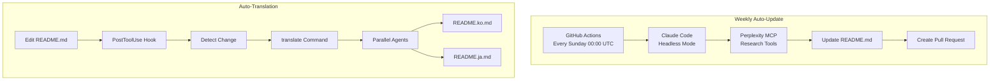
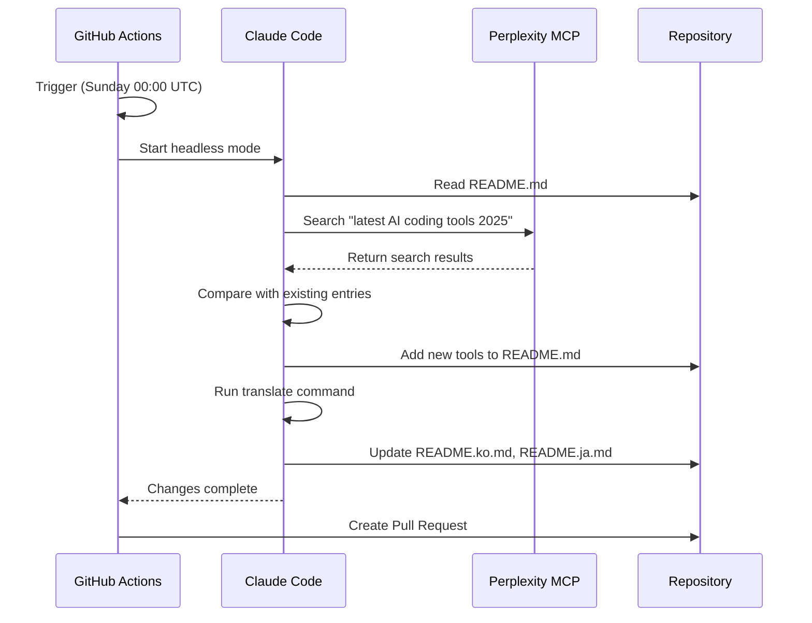
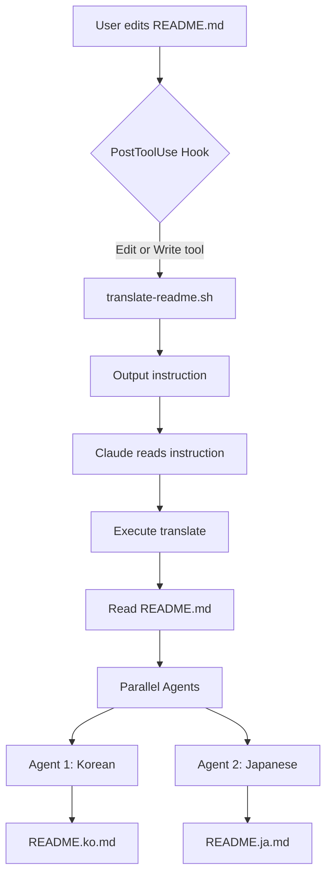
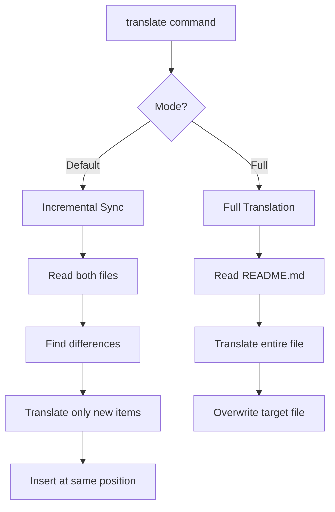

# Automation System

*[← Back to Main](../README.md)*

This document explains the automated systems that keep this repository up-to-date using Claude Code, GitHub Actions, and MCP integrations.

---

## Table of Contents

- [Overview](#overview)
- [Weekly Auto-Update System](#weekly-auto-update-system)
- [Auto-Translation System](#auto-translation-system)
- [Configuration Files](#configuration-files)
- [Setup Guide](#setup-guide)

---

## Overview

This repository uses two automated systems:

| System | Trigger | Purpose |
|--------|---------|---------|
| **Weekly Auto-Update** | GitHub Actions (cron) | Research and add new AI coding tools |
| **Auto-Translation** | Claude Code Hook | Sync Korean/Japanese translations |



---

## Weekly Auto-Update System

### How It Works

The weekly update system automatically researches and adds new AI coding tools to the README.



### Workflow Configuration

**File**: `.github/workflows/weekly-update.yml`

```yaml
name: Weekly README Update

on:
  schedule:
    - cron: '0 0 * * 0'  # Every Sunday at 00:00 UTC
  workflow_dispatch:     # Manual trigger
    inputs:
      category:
        description: 'Category to update'
        default: 'all'
```

### Categories

| Category | Section | Search Query |
|----------|---------|--------------|
| `ide` | IDE & Editor Assistants | AI coding IDE tools 2025 |
| `agentic` | Agentic Coding Environments | Autonomous AI coding agents 2025 |
| `cloud` | Cloud & Platform Integrations | AI cloud development platforms 2025 |
| `learning` | Learning Resources | Vibe coding research papers articles 2025 |
| `all` | All sections | All of the above |

### Manual Trigger

1. Go to **Actions** tab in GitHub
2. Select **Weekly README Update**
3. Click **Run workflow**
4. Optionally select a specific category

---

## Auto-Translation System

### How It Works

When README.md is edited, a hook automatically triggers translation to Korean and Japanese.



### Translation Modes

The `/translate` command supports two modes:



### Hook Configuration

**File**: `.claude/settings.json`

```json
{
  "hooks": {
    "PostToolUse": [
      {
        "matcher": "Edit|Write",
        "hooks": [
          {
            "type": "command",
            "command": "\"$CLAUDE_PROJECT_DIR/.claude/hooks/translate-readme.sh\""
          }
        ]
      }
    ]
  }
}
```

### Translation Command

**File**: `.claude/commands/translate.md`

The command instructs Claude to:
1. Read README.md and target language file
2. Identify new/modified/deleted items
3. Translate and insert at the exact same position
4. Preserve markdown formatting, links, and code blocks

### Translation Rules

| Rule | Example |
|------|---------|
| Keep technical terms | Claude Code, MCP, GitHub Actions |
| Keep URLs unchanged | `[Website](https://example.com)` |
| Preserve table structure | `\| Tool \| Description \|` |
| Add space after bold (Korean) | `**텍스트** 다음` |

---

## Configuration Files

### File Structure

```
.claude/
├── commands/
│   └── translate.md      # Translation command definition
├── hooks/
│   └── translate-readme.sh  # Hook script for auto-translation
├── mcp.json              # MCP server configuration
└── settings.json         # Claude Code settings

.github/
├── prompts/
│   └── weekly-update.md  # Update prompt template
└── workflows/
    └── weekly-update.yml # GitHub Actions workflow
```

### MCP Configuration

**File**: `.claude/mcp.json`

```json
{
  "mcpServers": {
    "perplexity-ask": {
      "command": "npx",
      "args": ["-y", "@anthropic-ai/mcp-perplexity"],
      "env": {
        "PERPLEXITY_API_KEY": "${PERPLEXITY_API_KEY}"
      }
    }
  }
}
```

---

## Setup Guide

### Prerequisites

- GitHub repository with Actions enabled
- Anthropic API key
- Perplexity API key

### Step 1: Set GitHub Secrets

```bash
gh secret set ANTHROPIC_API_KEY --body "your-key"
gh secret set PERPLEXITY_API_KEY --body "your-key"
```

### Step 2: Enable GitHub Actions

1. Go to repository **Settings**
2. Navigate to **Actions** → **General**
3. Enable "Allow all actions and reusable workflows"

### Step 3: Test Manual Trigger

1. Go to **Actions** tab
2. Select **Weekly README Update**
3. Click **Run workflow**
4. Monitor the workflow execution

### Step 4: Verify Auto-Translation

1. Make a small edit to README.md using Claude Code
2. Observe the hook output message
3. Confirm translations are updated

---

## Troubleshooting

### Weekly Update Issues

| Issue | Solution |
|-------|----------|
| Workflow not running | Check cron syntax and Actions permissions |
| API key errors | Verify secrets are correctly set |
| No changes detected | Check if new tools were found |
| PR creation failed | Verify `contents: write` permission |

### Translation Issues

| Issue | Solution |
|-------|----------|
| Hook not triggering | Verify settings.json configuration |
| Wrong file detected | Check file path matching in hook script |
| Translation incomplete | Ensure both files are readable |

---

*[← Back to Main](../README.md)*
