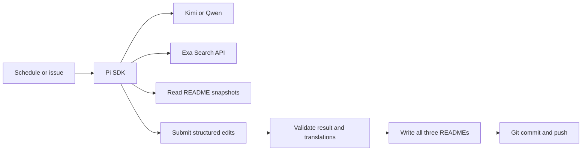

# Automation System

*[← Back to Main](../README.md)*

GitHub Actions uses the [Pi SDK](https://pi.dev/docs/latest/sdk) to run Kimi or Qwen for resource curation and translation. [Exa Search](https://exa.ai/docs/reference/search) supplies current web evidence. The application validates proposed changes before writing files; GitHub Actions commits and pushes successful updates to main.

## Workflows

| Workflow | Trigger | Behavior |
|---|---|---|
| Weekly README Update | Sunday 00:00 UTC or manual dispatch | Research resources, process pending candidates, add up to five entries, update three languages |
| Auto Process Issue | A human opens an issue with an addition label or URL, or adds the addition label | Validate the URL, assess quality, add and translate, commit and close |
| Issue Manual Review Handler | Maintainer comments exactly `/approve`, or `/reject [reason]` | Retry an approved resource or reject it |
| Test Automation | Changes to scripts, dependencies, prompts, or workflows | Run offline regression and Pi SDK integration tests |
| Lint Workflows | Workflow changes | Check Actions syntax and shell scripts |

All writing workflows share `readme-update` concurrency with `queue: max`. GitHub permits up to 100 waiting runs in this mode; it is not an unlimited queue. [GitHub concurrency documentation](https://docs.github.com/en/actions/how-tos/write-workflows/choose-when-workflows-run/control-workflow-concurrency)

The scheduled run does not skip research because a recent issue modified README.md. Manual weekly runs accept `category` (all, code, apps, context, quality, delivery, operations, learning) and `force_refresh` to bypass the search cache.

## Model and API configuration

The defaults were verified against the official providers' authenticated model lists on 2026-09-18:

| AI_PROVIDER | Default model | Default API base | GitHub Actions secret |
|---|---|---|---|
| `kimi` (default) | `kimi-k3` | `https://api.moonshot.ai/v1` | `KIMI_API_KEY` |
| `qwen` | `qwen3.8-max` | `https://dashscope-intl.aliyuncs.com/compatible-mode/v1` | `DASHSCOPE_API_KEY` |

Sources: [Kimi model list](https://platform.kimi.ai/docs/models), [Qwen model upgrade notice](https://www.alibabacloud.com/en/notice/alibaba_cloud_model_studio_model_upgrade_notice_81a?_p_lc=1). Pi packages are pinned to 0.85.1 in package.json and package-lock.json.

The model IDs are explicit defaults, not an alias that automatically discovers future releases. Update the defaults or set `AI_MODEL` when adopting a new compatible model. A missing key, unavailable model, or provider error fails the run; it never silently falls back to another provider.

Register these organization secrets and grant this repository access:

- `KIMI_API_KEY`: Moonshot/Kimi Open Platform API key; this is not a Kimi Code subscription credential.
- `DASHSCOPE_API_KEY`: Alibaba Cloud Model Studio pay-as-you-go API key for the chosen region.
- `EXA_API_KEY`: Exa API key. Required for weekly research and for accepting an issue: each accepted resource must cite observed search evidence.

For `roboco-io`, the organization secrets are restricted to `awesome-vibecoding`. GitHub resolves organization secrets through the same `secrets.NAME` expressions as repository secrets. Repository-level secrets with the same name take precedence, so avoid stale duplicate values.

The Actions workflows no longer use Anthropic or Perplexity credentials. Their deletion elsewhere in an organization is not required by this migration. Never put key values in Markdown, workflow YAML, command arguments, or logs.

Repository Actions variables provide optional overrides:

| Variable | Default | Purpose |
|---|---|---|
| `AI_PROVIDER` | `kimi` | Select `kimi` or `qwen` |
| `AI_MODEL` | Provider-specific default | Model ID in the same compatible family |
| `AI_BASE_URL` | Provider-specific official endpoint | HTTPS regional endpoint; must match the API key |
| `AI_MAX_TURNS` | `30` | Maximum agent turns, up to 100 |
| `AI_MAX_TOKENS` | `8192` | Per-response output-token limit, up to 32768 |
| `AI_TIMEOUT_SECONDS` | `600` | Agent timeout, up to 1800 seconds |

To switch to Qwen, set `AI_PROVIDER=qwen`. Leave `AI_MODEL` and `AI_BASE_URL` unset to use its defaults. When changing providers, clear incompatible overrides. These limits bound work; they are not a currency-denominated spending cap. GitHub jobs also have a 20-minute timeout.

## Execution and validation


```mermaid
flowchart LR
    TRIGGER[Schedule or issue] --> PI[Pi SDK]
    PI --> MODEL[Kimi or Qwen]
    PI --> EXA[Exa Search API]
    PI --> READ[Read README snapshots]
    PI --> PROPOSAL[Submit structured edits]
    PROPOSAL --> CHECK[Validate result and translations]
    CHECK --> WRITE[Write all three READMEs]
    WRITE --> COMMIT[Git commit and push]
```

Pi runs with an in-memory session and private temporary configuration. It does not load local extensions, skills, hooks, or AGENTS.md, and does not receive Bash or arbitrary filesystem tools. Its custom tools are:

| Tool | Access |
|---|---|
| `read_readme` | Read snapshots of the three allowed README files |
| `search_web` | Query the fixed Exa endpoint, up to 12 searches per run |
| `submit_result` | Propose exact text replacements and a structured status |
| `read_candidates` | Weekly runs only: read pending candidates from the cache |
| `queue_candidate` | Weekly runs only: save up to 20 candidates for later verification |
| `review_candidate` | Weekly runs only: reject or defer pending candidates with a reason |

Issue content and search results are untrusted data. Proposed edits stay in memory until the agent ends successfully. A missing result, error, truncated response, timeout, search failure, or turn-limit breach prevents publishing. Failed issue runs receive `needs-review`; they are not closed as successful.

Validation requires edits to all three languages, unique replacement anchors, preserved existing links, matching newly added resource URLs, and valid table column counts. The requested issue URL must appear in every language. Non-processed results cannot contain edits. Concurrent local changes are detected before writing.

The [curation policy](curation-policy.md) also requires five explicit passing checks and evidence URLs from the run's Exa results. Paid products and self-submissions receive the same review. A maintainer retry does not bypass these conditions. Temporary URL-access failures remain open for review.

The README uses six task catalogs and purpose-based learning sections. Resource tables contain four columns. New entries include explicit shared anchors, access conditions, and substantive verification dates. The recent-updates block uses local anchors; the application prunes it to ten rows within the last 30 dates, including successful weekly runs with no new resources. It never refreshes an entry's verification date merely because the page was regenerated.

The runner checks the current change's URL additions rather than assuming all historical translations are already identical. Semantic translation quality still depends on the model; deterministic checks do not prove every factual statement or translation is correct.

## Cache and candidate queue

The existing `.cache/awesome-vibecoding.db` SQLite file remains in use. Search results are stored with source `exa`, so old Perplexity responses cannot satisfy Exa queries. Results have a seven-day TTL; `FORCE_REFRESH=true` bypasses them. SQL parameters are bound, including queries and resource names containing quotes.

Weekly runs work on a temporary copy of the database. Only successful runs save searches, candidates, and run statistics. Existing `tool_metadata` data is preserved. Candidates already present in the English README, or added by the current run, are marked `added`. Unsuitable candidates can be rejected or deferred so they do not permanently block later entries. Deferred entries remain stored for a separate future review. The workflow commits the cache with the README changes, or alone when research succeeds without a new resource.

## Local use

Node.js 24.14 or newer is required. Install locked dependencies without lifecycle scripts:

```bash
npm ci --ignore-scripts
npm test
```

With the required API keys already in your environment:

```bash
npm run weekly-update
AI_PROVIDER=qwen CATEGORY=code FORCE_REFRESH=true npm run weekly-update
```

Issue entrypoints read `ISSUE_TITLE`, `ISSUE_BODY`, `ISSUE_NUMBER`, and optionally `ISSUE_URL` from environment variables. They write `result` and a single-line `reason` to `GITHUB_OUTPUT` when supplied. Local runs modify files but do not commit, push, or post comments.

Existing `.claude` translation helpers remain available for local editing. CI translation is performed by Pi in the same run and does not rely on those helpers. The local `/update-readme` command delegates to the Pi runner.

## Testing and troubleshooting

`npm test` uses temporary README files, temporary SQLite databases, mocked HTTP, and a mocked model stream through the real Pi SDK. It needs no credentials and tests failure handling, tool isolation, invalid edits, partial translations, output injection, cache behavior, and the successful write path.

| Symptom | Check |
|---|---|
| Missing API key | Organization secret name, selected repository access, and repository-level overrides |
| 401/403 from model provider | Key type and regional base URL |
| Unknown model | Official model list and `AI_MODEL` override |
| Exa failure | API key, quota, network response; the run fails instead of claiming current research |
| No accepted submission | Actions log, model output limits, and proposed-edit validation |
| Resource already listed | Review by URL and name; manual approval does not bypass duplicate checks |
| Translation mismatch | Fix the complete three-language proposal and retry |
| Linter rejects concurrency queue | actionlint 1.7.12 lacks this GitHub option; CI ignores only that exact unsupported-key diagnostic |

Do not rerun a failed workflow blindly after a partial GitHub-side failure. Inspect whether its commit was pushed before retrying an issue to avoid duplicate processing.
